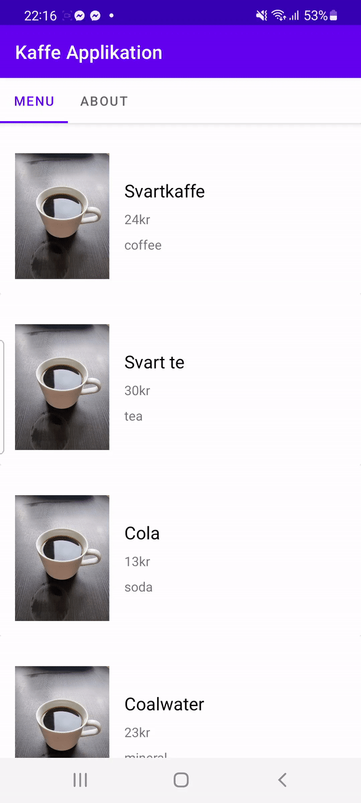

# RAPPORT

## JSON

### Datan

Först skapades det json data via en separat sida, som sedan kommer att hämtas till appen. JSON datan
ser ut såhär:

```
// (...)
{
"ID": "b21phiro_001",
"name": "Svartkaffe",
"type": "b21phiro",
"company": "Radical Coffee",
"location": "Katrineholm",
"category": "coffee",
"size": 33,
"cost": 24,
"auxdata": "https://db3pap003files.storage.live.com/y4mQldLON7Tcza7OXSXrJDv6SWDv42bl3iAk0KMOEhweIkUxgC3xiX4Op4LKQfVlp-mr_tTpq0ovylmXxqDrj5anJRTGTnQVNdxM95mXdPHLJwVpqeqXfsmqi-yPxUPSVjwdmGVCfGeOK1Gxyd3QrOSf6hZV1fm2l7krUas2aQOIAwY06jfYjaLEdfrcx4Z9NTEVnG0JwZywVz_PAOShURNCEVDS-4qJKiTqnAYBVpRi8g?encodeFailures=1&width=663&height=885"
}
// (...)
```

### Internet permission

Först måste vi hämta datan, vilket kräver tillgång till internet som vi förfrågar hos manifestet.

```
// AndroidManifest.xml
// (...)
<uses-permission android:name="android.permission.INTERNET" />
// (...)
```

### JsonTask

Till uppgiften ska vi använda oss utav klassen "JsonTask" som är en färdigbyggd klass. Jag skapar en 
separat klass-fil för just [JsonTask som kan hittas här](https://raw.githubusercontent.com/LenaSYS/mobileapp-programming-networking/master/app/src/main/java/com/example/networking/JsonTask.java).
Denna klass instanserar jag hos MainActivity. JSON datans URL initieras som en privat-medlem hos 
MainActivity.

```
// MainActivity.java

private final String JSON_FILE = "https://mobprog.webug.se/json-api?login=b21phiro";

protected void onCreate(Bundle savedInstanceState) {
    // (...)
    JsonTask jsonTask = new JsonTask(this);
    jsonTask.execute(this.JSON_FILE);
    // (...)
}

```

Nu när vi kan hämta datan, vill jag sätta in dem i Java klasser. Jag skapar klassen "Drink" som 
representerar entitererna från JSON-datan. 

```
// Drink.java
public class Drink {
    private String id, name, type, company, location, category, auxdata;
    private Integer size, cost;
    
    public Drink(String id, String name, String type, String company, String location, String auxdata, String category, Integer size, Integer cost) {
        this.id = id;
        this.name = name;
        this.type = type;
        this.company = company;
        this.location = location;
        this.category = category;
        this.size = size;
        this.cost = cost;
        this.auxdata = auxdata;
    }
    
    // GET / SETTERS (...)
```

Nu när vi har en klass för entiterna, kan vi fortsätta med JsonTask. JsonTask har metoden "OnPostExecute"
som körs när datan har hämtats. Det är i denna metod som vi kommer göra saker med JSON-datan. Jag kommer 
ta till hjälp av [biblioteket Gson](https://github.com/google/gson). Det är Gson som gör själva 
konverteringen av JSON-string-datan till Java-klass-objekt.

All JSON konverteras till Drink-objekt, som stoppas in i ArrayList<Drink> "drinks".

Sist skickas allt till RecyclerViewn (listan)...

```
// MainActivity.java
(...)
private ArrayList<Drink> drinks;
(...)
@Override
public void onPostExecute(String json) {
    Gson gson = new Gson();
    Type type = new TypeToken<ArrayList<Drink>>(){}.getType();
    this.drinks = gson.fromJson(json, type);

    RecyclerView recyclerView = findViewById(R.id.cupHolder);
    recyclerView.setLayoutManager(new LinearLayoutManager(this));

    adapter = new DrinkRecyclerViewAdapter(this, this.drinks);
    recyclerView.setAdapter(adapter);

}
```

## RecyclerView

Först lägger vi till en RecyclerView där vi vill ha den (activity_main.xml). Den får id't "cupHolder",
för det är drinkarna som den ska hålla.

```
<!-- activity_main.xml -->
<androidx.recyclerview.widget.RecyclerView
                android:id="@+id/cupHolder"
                android:layout_width="match_parent"
                android:layout_height="match_parent"
                app:layout_constraintStart_toStartOf="parent"
                app:layout_constraintTop_toTopOf="parent" />
```

Sedan behövs listraderna en design, jag skapar en "item_row.xml" inom layout-mappen. Dessa "rader"
designar jag som kort med bilder och text.

```
<!-- item_row.xml -->
<androidx.cardview.widget.CardView
        android:layout_width="match_parent"
        android:layout_height="wrap_content"
        app:layout_constraintStart_toStartOf="parent"
        app:layout_constraintTop_toTopOf="parent">

        <LinearLayout
            android:layout_width="match_parent"
            android:layout_height="wrap_content"
            android:orientation="horizontal"
            android:layout_marginTop="16dp"
            android:padding="16dp">

            <ImageView
                android:id="@+id/image"
                android:layout_width="200dp"
                android:layout_height="wrap_content"
                android:layout_weight="1"
                android:adjustViewBounds="true"
                android:scaleType="centerCrop"
                tools:srcCompat="@tools:sample/avatars" />

            <LinearLayout
                android:layout_width="match_parent"
                android:layout_height="wrap_content"
                android:layout_gravity="center"
                android:layout_weight="1"
                android:orientation="vertical"
                android:paddingStart="16dp">

                <TextView
                    android:id="@+id/name"
                    android:layout_width="match_parent"
                    android:layout_height="wrap_content"
                    android:text="TextView"
                    android:textColor="#000"
                    android:textSize="19sp" />

                <TextView
                    android:id="@+id/cost"
                    android:layout_width="match_parent"
                    android:layout_height="wrap_content"
                    android:layout_marginVertical="8dp"
                    android:text="TextView" />

                <TextView
                    android:id="@+id/category"
                    android:layout_width="match_parent"
                    android:layout_height="wrap_content"
                    android:text="TextView" />
            </LinearLayout>
```

### RecyclerView Adapter

Nu när vi har XML'n för RecyclerViewn och korten, behöver vi sätta in logik. Först behöver vi skapa 
"adaptern" som sen används av recycler viewn. Den kommer iterera igenom antalet rader som finns i drinks (ArrayList<Drink>). 
För varje rad, kommer en ViewHolder skapas (kort), och den iteration-inom-drinks vi är på, kommer vars data
sättas in hos korten (onBindViewHolder). Konstruktören vill bara ha i vilket Aktivitets-kontext som berör sig, samt 
data (Drinks).

```
public class DrinkRecyclerViewAdapter extends RecyclerView.Adapter<DrinkRecyclerViewAdapter.ViewHolder> {

    private ArrayList<Drink> drinks;
    private LayoutInflater inflater;

    public DrinkRecyclerViewAdapter(Context context, ArrayList<Drink> drinks) {
        this.inflater = LayoutInflater.from(context);
        this.drinks = drinks;
    }

    @NonNull
    @Override
    public DrinkRecyclerViewAdapter.ViewHolder onCreateViewHolder(@NonNull ViewGroup parent, int viewType) {
        View view = inflater.inflate(R.layout.item_row, parent, false);
        return new ViewHolder(view);
    }

    @Override
    public void onBindViewHolder(@NonNull DrinkRecyclerViewAdapter.ViewHolder holder, int position) {
        Drink drink = drinks.get(position);
        holder.name.setText(drink.getName());
        holder.cost.setText(drink.getCost().toString()+"kr");
        holder.category.setText(drink.getCategory());
        Picasso.get().load(drink.getAuxdata()).into(holder.image);
    }

    @Override
    public int getItemCount() {
        return drinks.size();
    }

    public class ViewHolder extends RecyclerView.ViewHolder {

        private TextView name, cost, category;
        private ImageView image;

        public ViewHolder(@NonNull View itemView) {
            super(itemView);
            name = itemView.findViewById(R.id.name);
            cost = itemView.findViewById(R.id.cost);
            category = itemView.findViewById(R.id.category);
            image = itemView.findViewById(R.id.image);
        }
    }
}
```

Koden visades tidigare, men efter att JSON datan konverteras till drink-objekt, hämtas "cupHolder" (RecyclerView),
som sedan får adaptern (DrinkRecyclerViewAdapter) "monterad" på sig. Det är DrinkRecyclerViewAdapter som tar emot
drinkarna genom sin konstruktör tillsammans med kontextet. 

```
// MainActivity.java
(...)
private ArrayList<Drink> drinks;
(...)
@Override
public void onPostExecute(String json) {
    (...)
    this.drinks = gson.fromJson(json, type);

    RecyclerView recyclerView = findViewById(R.id.cupHolder);
    recyclerView.setLayoutManager(new LinearLayoutManager(this));

    adapter = new DrinkRecyclerViewAdapter(this, this.drinks);
    recyclerView.setAdapter(adapter);

}
```

## About sida

About sidan är en HTML-sida, som visas med hjälp av klassen Webview. Först skapades en separat aktivitet (about.java)
som i sin layout endast har en Webview (med id't webView).

```
<!--activity_about.xml-->
<?xml version="1.0" encoding="utf-8"?>
<androidx.constraintlayout.widget.ConstraintLayout xmlns:android="http://schemas.android.com/apk/res/android"
    xmlns:app="http://schemas.android.com/apk/res-auto"
    xmlns:tools="http://schemas.android.com/tools"
    android:layout_width="match_parent"
    android:layout_height="match_parent"
    tools:context=".About">

    <WebView
        android:id="@+id/webview"
        android:layout_width="match_parent"
        android:layout_height="match_parent"
        app:layout_constraintStart_toStartOf="parent"
        app:layout_constraintTop_toTopOf="parent" />
</androidx.constraintlayout.widget.ConstraintLayout>
```

Sedan i "About" aktiviteten instanseras WebView objektet med id't för webviewn (som har id't webView somsagt). Metoden
loadUrl(STRING) används, där vägen till HTML filen ges. 

```
// About.java
public class About extends AppCompatActivity {

    private WebView webView;

    @Override
    protected void onCreate(Bundle savedInstanceState) {
        super.onCreate(savedInstanceState);
        setContentView(R.layout.activity_about);

        webView = findViewById(R.id.webview);
        webView.loadUrl("file:///android_asset/about.html");
    }
}
```

About aktiviteten startas genom att man klickar på "navigations" tabbar. Tyvärr används denna komponent endast i 
MainActivity, vilket betyder att den syns inte hos AboutActivity. När man klickar på about-tabben aktiveras en ny
intent, där intent-konstruktören tar emot två parametrar (tidigare/nu klassen, nästa klass).

```
// MainActivity.java
// (...)
tabLayout = findViewById(R.id.tabs);
tabLayout.addOnTabSelectedListener(new TabLayout.OnTabSelectedListener() {
    @Override
    public void onTabSelected(TabLayout.Tab tab) {
        switch (tab.getPosition()) {
            case 0:
                break;
            case 1:
                Intent intent = new Intent(MainActivity.this, About.class);
                startActivity(intent);
                break;
        }
    }

    @Override
    public void onTabUnselected(TabLayout.Tab tab) {

    }

    @Override
    public void onTabReselected(TabLayout.Tab tab) {

    }
});

// (...)
```

